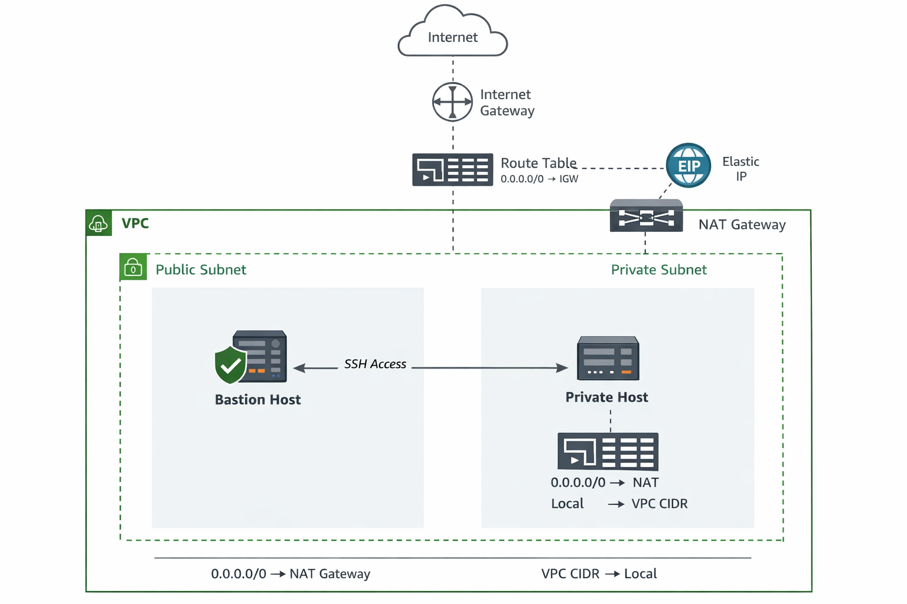

## Implementation of Defence-in-Depth Principles to Secure a VPC and Enable Controlled Bastion Access to Private Instances



This explains the bastion / private-host architecture diagram and what each component is doing.

## 1) VPC boundary

Everything sits inside a single **VPC (10.0.0.0/16)**.
Inside the VPC you have **two subnets**:

* **Public Subnet (e.g., 10.0.1.0/27)**
* **Private Subnet (e.g., 10.0.2.0/27)**

“Public” vs “Private” is not about a security group — it’s about the **route table** attached to the subnet.

---

## 2) Internet Gateway (IGW)

The **Internet Gateway** is attached to the VPC.
It provides a path between the public internet and resources in **public subnets** *that have public IPs*.

**What it enables:**

* Your laptop → **SSH to bastion** (because bastion has public IP + SG allows port 22)

---

## 3) Public Subnet (Bastion Host lives here)

The **bastion host EC2** is in the public subnet and typically has:

* A **public IP** (auto-assigned or Elastic IP)
* A security group that allows **SSH (22) from your IP only**

**Traffic flow:**

* **Your laptop (Internet)** → IGW → public subnet route → **Bastion EC2**

This is your controlled entry point to the VPC.

---

## 4) NAT Gateway + Elastic IP (EIP)

The **NAT Gateway** is deployed **in the public subnet** and is assigned an **Elastic IP**.

**Why it needs an EIP:**

* The NAT Gateway must have a **public, routable source IP** to reach the internet.
* Private instances don’t have public IPs, so NAT “translates” their private source IPs to the NAT’s public EIP for outbound traffic.

**What NAT enables:**

* Private subnet instances can do outbound things like:

  * `yum/apt update`
  * pull packages
  * reach AWS public endpoints (STS, S3 public endpoints, etc.)
* But the internet can’t initiate connections back to them.

---

## 5) Private Subnet (Private Host lives here)

The **private host EC2** is in the private subnet and has:

* **No public IP**
* A security group that allows **SSH only from the Bastion SG** (not from the internet)

**Inbound access path:**

* You SSH to bastion first
* Then from bastion you SSH to the private host using its **private IP** (10.0.2.x)

**Outbound access path:**

* Private EC2 → private route table default route → NAT Gateway → IGW → Internet

---

## 6) Route Tables (this is what defines public vs private)

### Public route table (associated to public subnet)

* `0.0.0.0/0 → Internet Gateway`
* plus `local → VPC CIDR` (automatic)

This makes the subnet “public”.

### Private route table (associated to private subnet)

* `0.0.0.0/0 → NAT Gateway`
* plus `local → VPC CIDR` (automatic)

This makes the subnet “private”.

---

## 7) SSH access (two-hop)

There are two SSH “hops” shown in the diagram:

1. **Internet → Bastion**

   * Needs: public IP + SG inbound 22 from your IP

2. **Bastion → Private Host**

   * Needs: private SG inbound 22 from bastion SG 
   * Uses private IP: `10.0.2.13`, `10.0.2.22`, etc.

---

## 8) Why this pattern is used

* Private instances are not exposed to the internet.
* Bastion is a single controlled entry point.
* NAT provides outbound-only internet for private resources.
* Security groups enforce least-privilege network access.

---


**### Commands to SSH into your Bastion and Private instance**


On your local machine: ```console
ssh -A -i ~/.ssh/mykey ec2-user@
```
use SSH agent forwarding (don’t copy keys to bastion)
I use SSH agent forwarding so I don’t have to store private keys on a bastion host. The key remains on my local machine, and the bastion only forwards authentication requests. This reduces the risk of key compromise and aligns with least-privilege and secure access best practices

On your laptop:

ssh-add ~/.ssh/my-host
ssh -A ec2-user@<BASTION_PUBLIC_IP>


Then on the bastion:

ssh ec2-user@<PRIVATE_IP>

